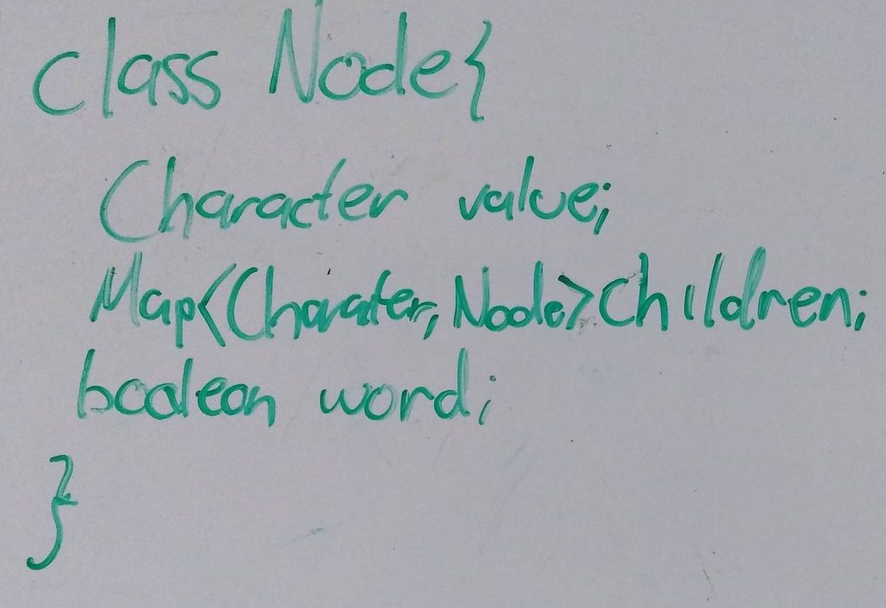
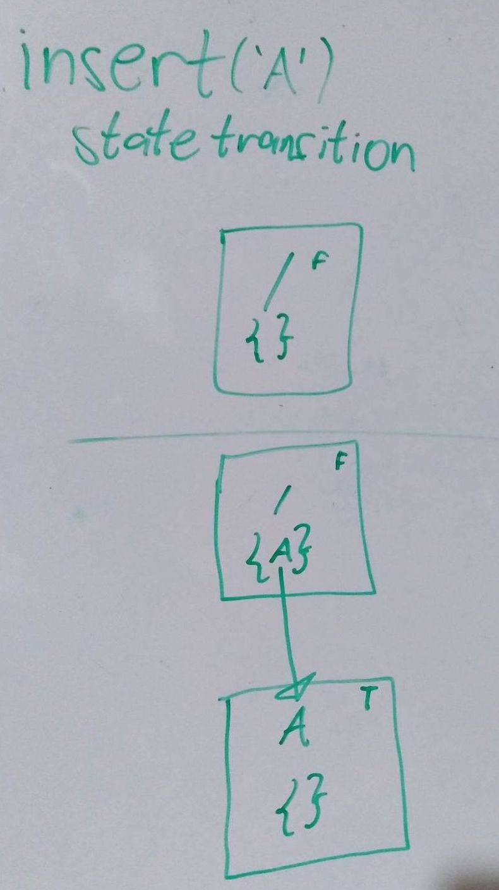
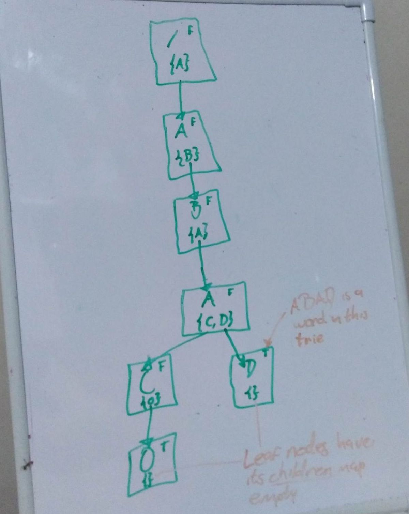

# Autocomplete Trie

Trie is a tree-like data structure where its nodes hold a collection (as opposed to only 2 in binary trees) with links to other nodes.  

**Why tries tho?**  

* Operations like `search`, `delete` and `insert` can be performed in *O(n)*.

**Why not tries?**  

* It requires space. E.g., In a trie used to store the names of employees, the names of employees with the same name is stored only once, only the counter of how many words end there is incremented with each repeated name. It looks like it is space efficient.  
However, the space efficiency can be compromised with the references (kept in the collection) to the nodes.


Tries are useful in a variety of use cases. Here we are looking at the **autocompletion** case.  

This work was inspired by the [Implement TRIE | Leetcode #208 video](https://www.youtube.com/watch?v=xqsaAhQC6c8). Which explains tries and how to search in tires but it doesn't go into how to implement the actual autocompletion. 

## The implementation
As with any problem is important to conceptualize how the actual data structure looks like.


Node  



Insert state transition  


### The suggestions
The method `suggest` returns a list of suggestions for the given prefix. See the method [in the class here](https://github.com/user454322/alg-ds/blob/main/trie/autocomplete/AutoCompleteTrie.java#L56-L77).

```java
public List<String> suggest(final String prefix) {
        List<String> suggestions = new ArrayList<>();
        Node node = root;
        Map<Character, Node> subtree = root.children;
        StringBuilder path = new StringBuilder();

        // Travers the trie up to the given prefix
        for (int level = 0; level < prefix.length(); level++) {
            Character value = prefix.charAt(level);
            node = subtree.get(value);
            if (node == null) {
                return emptyList();
            }
            path.append(value);
            subtree = node.children;
        }

        // Search in the trie for words that start with the given prefix
        findSuggestions(node, suggestions, path);

        return suggestions;
    }
```

It first traverses the tree up to the given key, then it keeps traversing the rest of the subtree calling the recursive method [findSuggestions](https://github.com/user454322/alg-ds/blob/main/trie/autocomplete/AutoCompleteTrie.java#L79-L99).

```java
// Recursive method used to find suggestions
    private void findSuggestions(final Node node, final List<String> suggestions,
                                 final StringBuilder path) {
        if (node.isWord()) {
            suggestions.add(path.toString());
        }

        Map<Character, Node> children = node.children;
        if (children.isEmpty()) {
            // We have reached a leaf node
            return;
        }

        for (Node subtree : children.values()) {
            // Traverse the subtree searching for words
            path.append(subtree.value);
            findSuggestions(subtree, suggestions, path);
            path.setLength(path.length() - 1);
        }
    }
```

### Executing it


Trie

The code in the [main method](https://github.com/user454322/alg-ds/blob/main/trie/autocomplete/AutoCompleteTrie.java#L101)

```java
String prefix = "Y";
        System.out.println(format("Suggesting for %s", prefix));
        System.out.println(format("  %s", trie.suggest(prefix)));
        System.out.println();

        prefix = "A";
        System.out.println(format("Suggesting for %s", prefix));
        System.out.println(format("  %s", trie.suggest(prefix)));
        System.out.println();

        prefix = "ABA";
        System.out.println(format("Suggesting for %s", prefix));
        System.out.println(format("  %s", trie.suggest(prefix)));
        System.out.println();

        prefix = "X";
        System.out.println(format("Suggesting for %s", prefix));
        System.out.println(format("  %s", trie.suggest(prefix)));
```

produces

```
Words in the trie [ABAD, ABACO, ASTRAZENECA, BACHILLER, CAMILLA, ETHER, MARXISM, STELLAR, XLM]
Suggesting for Y
  []

Suggesting for A
  [ABACO, ABAD, ASTRAZENECA]

Suggesting for ABA
  [ABACO, ABAD]

Suggesting for X
  [XLM]
```
